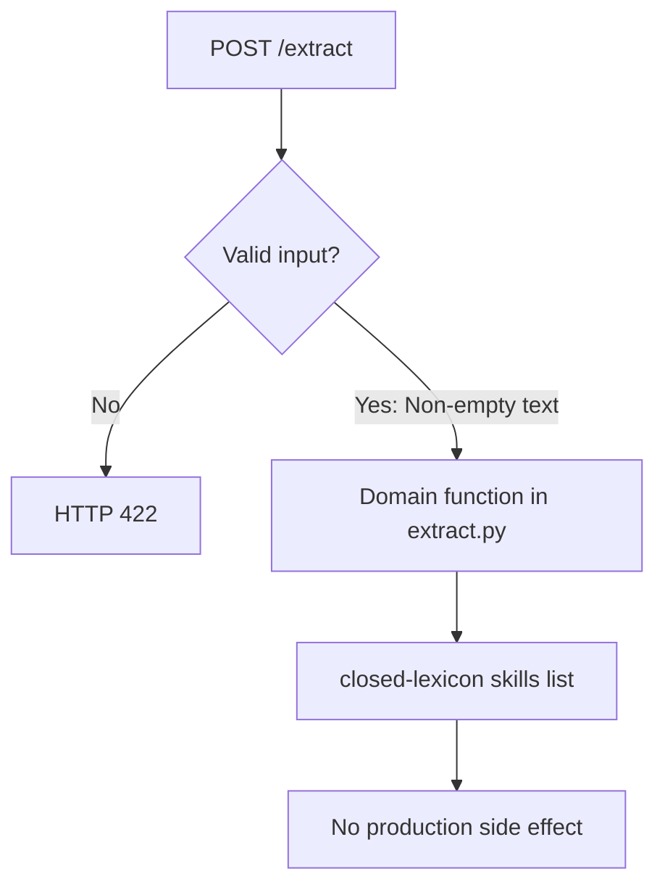

# Resume Skill Extractor: process flows

## Domain request

Endpoint: `POST /extract`. Stages summarize [src/skillsx/extract.py](../src/skillsx/extract.py). This is in-process Python, not a hosted model or production apply.

See [INTERVIEW_QA.md](../INTERVIEW_QA.md) for fixture walkthroughs and [PROJECT_ARCHITECTURE.md](../PROJECT_ARCHITECTURE.md) for the component map.
